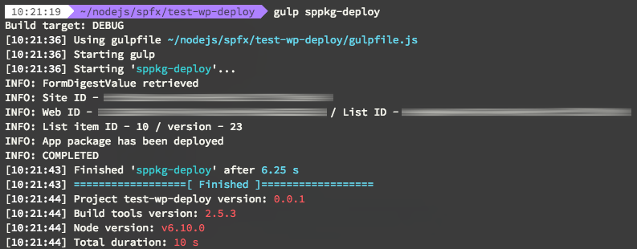

# SharePoint APP Package Deployment

[](https://nodei.co/npm/node-sppkg-deploy/)

This is a project created for automating the deployment process of SharePoint application packages in the App Catalog site.

## Installation
Run the following command to install the `node-sppkg-deploy`:

```
$ npm install node-sppkg-deploy --save-exact
```

## Usage

Once you installed this dependency, you can make use of it with the following provided sample code:

```javascript
const sppkgDeploy = require('node-sppkg-deploy');

sppkgDeploy.deploy({
    username: "username", // The user that will deploy the file
    password: "password", // The password of the user
    tenant: "tenant", // The tenant name. Example: contoso
    site: "sites/catalog", // Path to your app catalog site
    filename: "app.sppkg", // Filename of the package
    skipFeatureDeployment: true, // Do you want to skip the feature deployment (SharePoint Framework)
    verbose: true // Do you want to show logging during the deployment
});
```

## Arguments / options

The following arguments / options can be passed for deploying the package.

### username (required)

Type: `String`
Default: `""`

Sets the username to be used for the deployment.

### password (required)

Type: `String`
Default: `""`

Sets the password to be used for the deployment.

### tenant (required)

Type: `String`
Default: `""`

Sets the tenant name to be used for the deployment.

### site (required)

Type: `String`
Default: `""`

Specify the relative path to the app catalog site. Example: "sites/catalog"

### filename (required)

Type: `String`
Default: `""`

The name of the package that needs to be deployed.

### skipFeatureDeployment (optional)

Type: `Boolean`
Default: `true`

Specify if you want to skip feature deployment. When set to true, your customizations will be tenant-scoped.

> More information about the **skipFeatureDeployment** option can be found here: [Tenant-Scoped solution deployment for SharePoint Framework solutions](https://dev.office.com/sharepoint/docs/spfx/tenant-scoped-deployment).

### filename (optional)

Type: `Boolean`
Default: `false`

Specify if you want to show the console logs.

## Where can this be used?

This dependency can for example be used in your SharePoint Framework release process. Here is a sample gulp task that you can add to your SPFx project:

```javascript
const sppkgDeploy = require('node-sppkg-deploy');

const environmentInfo = {
  "username": "",
  "password": "",
  "tenant": "",
  "catalogSite": ""
}

build.task('sppkg-deploy', {
  execute: (config) => {
    environmentInfo.username = config.args['username'] || environmentInfo.username;
    environmentInfo.password = config.args['password'] || environmentInfo.password;
    environmentInfo.tenant = config.args['tenant'] || environmentInfo.tenant;
    environmentInfo.catalogSite = config.args['catalogsite'] || environmentInfo.catalogSite;

    const pkgFile = require('./config/package-solution.json');
    if (pkgFile) {
      // Retrieve the filename from the package solution config file
      let filename = pkgFile.paths.zippedPackage;
      // Remove the solution path from the filename
      filename = filename.split('/').pop();
      // Retrieve the skip feature deployment setting from the package solution config file
      const skipFeatureDeployment = pkgFile.solution.skipFeatureDeployment ? pkgFile.solution.skipFeatureDeployment : false;
      // Deploy the SharePoint package
      return sppkgDeploy.deploy({
        username: environmentInfo.username,
        password: environmentInfo.password,
        tenant: environmentInfo.tenant,
        site: environmentInfo.catalogSite,
        filename: filename,
        skipFeatureDeployment: skipFeatureDeployment,
        verbose: true
      });
    }
  }
});
```

Once this task is in place, you can run it with: `gulp sppkg-deploy` or `gulp sppkg-deploy --username "" --password "" --tenant "" --catalogsite ""`.

> More information about using arguments in SPFx gulp tasks can be found here: [Passing arguments with custom Gulp tasks for SharePoint Framework projects](https://www.eliostruyf.com/passing-arguments-with-custom-gulp-tasks-for-sharepoint-framework-projects/).

Output of the task:

